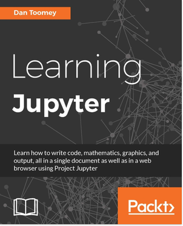
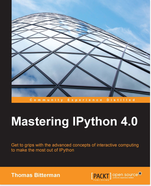
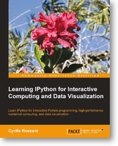

=====
Books
=====

Learning Jupyter
----------------

* `Learning Jupyter <https://www.packtpub.com/big-data-and-business-intelligence/learning-jupyter>`_
* By Dan Toomey
* 238 Pages
* Packt Publishing
* November 2016

Jupyter Notebook is a web-based environment that enables interactive computing
in notebook documents. It allows you to create and share documents that contain
live code, equations, visualizations, and explanatory text. The Jupyter
Notebook system is extensively used in domains such as data cleaning and
transformation, numerical simulation, statistical modeling, machine learning,
and much more.

This book starts with a detailed overview of the Jupyter Notebook system and
its installation in different environments. Next we’ll help you will learn to
integrate Jupyter system with different programming languages such as R,
Python, JavaScript, and Julia and explore the various versions and packages
that are compatible with the Notebook system. Moving ahead, you master
interactive widgets, namespaces, and working with Jupyter in a multiuser mode.

Towards the end, you will use Jupyter with a big data set and will apply all
the functionalities learned throughout the book.

Mastering IPython 4.0
---------------------

* `Mastering IPython 4.0 <https://www.packtpub.com/big-data-and-business-intelligence/mastering-ipython-40>`_
* by `Thomas Bitterman <https://www.packtpub.com/books/info/authors/thomas-bitterman>`_
* 382 pages
* Packt Publishing
* May 2016
* Code available under MIT License `on GitHub <https://github.com/PacktPublishing/Mastering-IPython-4>`_

This book will get IPython developers up to date with the latest advancements
in IPython and dive deep into interactive computing with IPython. This an
advanced guide on interactive and parallel computing with IPython will explore
advanced visualizations and high-performance computing with IPython in detail.

You will quickly brush up your knowledge of IPython kernels and wrapper
kernels, then we'll move to advanced concepts such as testing, Sphinx, JS
events, interactive work, and the ZMQ cluster. The book will cover topics such
as IPython Console Lexer, advanced configuration, and third-party tools.

By the end of this book, you will be able to use IPython for interactive and
parallel computing in a high-performance computing environment.

IPython Cookbook
----------------

.. image:: _static/ipython-cookbook.jpg
    :width: 200px
    :alt: IPython Cookbook
    :target: _static/ipython-cookbook.jpg

* `IPython Interactive Computing and Visualization Cookbook <http://ipython-books.github.io/cookbook/>`_
* by `Cyrille Rossant <http://cyrille.rossant.net>`_
* 512 pages
* Packt Publishing
* September 25 2014

This is an advanced-level guide to IPython for data science, and the sequel of
the IPython minibook.

IPython Minibook
----------------

* `Learning IPython for Interactive Computing and Data Visualization <http://ipython-books.github.io/minibook/>`_
* by `Cyrille Rossant <http://cyrille.rossant.net>`_
* 175 pages
* Packt Publishing
* October 25 2015

This book is a beginner-level introduction to Python for data analysis, covering IPython, the Jupyter Notebook, pandas, NumPy, matplotlib, and many other libraries. There is an introduction to the Python programming language for complete beginners. There are also contents for more advanced users, like parallel computing with IPython and high-performance computing with Numba and Cython.

Get your Book on this page
--------------------------

Getting your book on this page will automatically add it on the sidebar.

Thanks for writing about IPython or Jupyter, we would be happy to get a link to
your book on this page, the simplest would be to submit a GitHub Pull Request
against `The IPython website repository page
<https://github.com/ipython/ipython-website/blob/master/books.rst>`_. You can
also directly contact us in order to do that for you.

A requirement for a book to be listed on this page is that all the code
examples included in the book are licensed under an OSI-approved license.
Besides, we recommend non-copyleft license such as CC-0.

We reserve the right to refuse or remove any publication at our discretion.

You can get more information by reading our :ref:`books_policy`.

