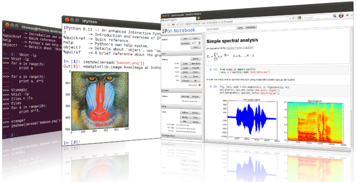
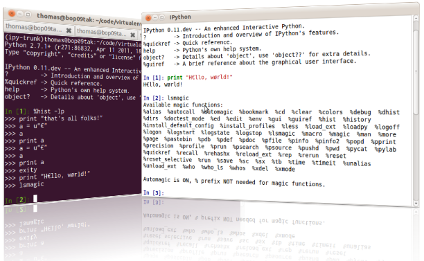

====
News
====

Roadmap to 1.0 and Beyond
-------------------------

IPython 1.0 is coming mid-July 2013. See the grant_ which is funding the bulk
of the work, as well as our roadmap_ for achieving the grant's objectives.
`Read on for more details <roadmap-announcement.html>`_.

.. _grant: http://ipython.org/sloan-grant.html
.. _roadmap: https://github.com/ipython/ipython/wiki/Roadmap:-IPython

Sloan Foundation Grant
----------------------

IPython has been awarded a $1.15 million grant from `the Alfred P. Sloan
Foundation <http://www.sloan.org/>`_. This will support several core developers,
who'll focus on building the IPython Notebook into a tool for open, collaborative,
reproducible scientific computing. We'll also be bringing developers together
for two sprints each year in California. `See more details. <sloan-grant.html>`_

IPython 0.13
------------
IPython 0.13 was released on June 30, 2012. This release sees a substantial
redesign of the IPython Notebook, the introduction of 'cell magic functions',
as well as numerous other improvements. `Download <download.html>`__ it now, or
see the `release notes
<http://ipython.org/ipython-doc/rel-0.13/whatsnew/version0.13.html>`__ for more
details.

IPython 0.12.1
--------------

IPython 0.12.1 was released on April 21, 2012.  This is a bugfix-only release;
no new features have been introduced but `over 70 issues`_ have been fixed.
All users of IPython 0.12 are encouraged to upgrade to this release.

.. _over 70 issues: http://ipython.org/ipython-doc/stable/whatsnew/github-stats-0.12.html#issues-list-012

IPython 0.12
------------

IPython 0.12 was released on 18 December 2011. The major new feature with this
release is the `IPython Notebook <ipython-doc/dev/interactive/htmlnotebook.html>`_,
an interactive Python interface running in the browser. `Download <download.html>`_
it now, or read more about `what's new
<http://ipython.org/ipython-doc/rel-0.12/whatsnew/version0.12.html>`_.

Try IPython online
------------------

As of Autumn 2011, you can `try IPython online
<http://www.pythonanywhere.com/try-ipython/>`__ in your browser. New users can
explore the features before installing it, or you can do some quick
calculations from any computer with web access.

Thanks to the guys at `PythonAnywhere <http://www.pythonanywhere.com/>`__ for
providing this. If you sign up for an account there (it's in beta at the moment),
you also get persistent consoles, disk space, and more.

IPython 0.11
------------

We're pleased to announce the immediate release of IPython 0.11, on 31 July 2011.
Despite the small shift in the version number, this brings a lot of changes,
including a new Qt frontend and a rewritten parallel computing framework.
`Download <download.html>`__ it now, or look at `what's new
<http://ipython.org/ipython-doc/rel-0.11/whatsnew/version0.11.html>`__.

User survey
-----------

From May to September 2011, we ran a survey to find out more about who uses
IPython, amassing 240 responses by the time we closed it. We'd like to thank all
the respondents, and invite you to `read the findings <usersurvey2011.html>`__.

IPython 0.10.2 released
-----------------------

IPython 0.10.2 was released on 9 April, 2011. This is a bugfix release for the
0.10 series. See the `release notes
<http://ipython.org/ipython-doc/rel-0.10.2/html/changes.html#release-0-10-2>`__
for more details.

Python 3 support in progress
----------------------------

Work has started to get IPython running on Python 3. If you're interested in
testing it, get `the code <https://github.com/ipython/ipython-py3k>`__ from
GitHub. We hope to release this along with IPython 0.11.

IPython 0.10.1 is out!
----------------------

On October 11, 2010, we released IPython 0.10.1. The full release notes can be
found `here
<http://ipython.org/ipython-doc/rel-0.10.1/html/changes.html#release-0-10-1>`__
,
describing in detail the changes in this release.

Windows HPC Server Case Study
-----------------------------

As a result of the Microsoft-funded work on providing support for Windows HPC
Server 2008, a `case study
<http://www.microsoft.com/casestudies/Case_Study_Detail.aspx?CaseStudyID=4000007661
case study>`__ is now available that provides some details on the collaboration
between IPython and the University of Colorado's Mechanical Engineering
Department.

Support for Windows HPC Server 2008
-----------------------------------

Recently, we have added support for Windows HPC Server 2008 in ipcluster.  This
makes it easy to get started with IPython's parallel computing capabilities on
Windows. These features are now in trunk and will be in the upcoming 0.11
release.  Brian Granger has created a `whitepaper
<attachment:ipython_winhpc_whitepaper_v1.pdf>`__ and `two
<http://channel9.msdn.com/shows/The+HPC+Show/Open-source-HPC-code-Episode-11-IPython-Grid-Engine-running-on-Windows-HPC-Server-2008/>`__
`videos
<http://channel9.msdn.com/shows/The+HPC+Show/Open-source-HPC-code-Episode-12-IPython-computes-150-million-digits-of-Pi-in-Parallel/>`__
about using IPython on Windows HPC Server 2008. Additional information about
these features can be found in our documentation `here
<http://ipython.scipy.org/doc/nightly/html/parallel/parallel_winhpc.html>`__.
Many thanks to Microsoft for funding this effort.

What will become IPython 0.11 is taking shape, big changes ahead
----------------------------------------------------------------

As of November 2009, we have major changes coming to IPython. The next release
will include a lot of architectural updates, all of which we know are necessary
to really make significant improvements to IPython, but that also include
inevitable backward compatibility breaks.  We would like to encourage you to
start looking at the `nightly documentation
<http://ipython.scipy.org/doc/nightly/html/whatsnew/development.html>`__ and
`source tarball
<http://ipython.scipy.org/dist/testing/ipython-dev-nightly.tgz>`__ (you can also
follow the trunk from `Launchpad <https://launchpad.net/ipython/trunk>`__).

IPython 0.10 has been released
------------------------------

On August 4 2009, we've released version 0.10 of IPython.  The full release
notes can be found `here
<http://ipython.scipy.org/doc/rel-0.10/html/changes.html#release-0-10>`__,
describing in detail all new features, bug fixes and API changes of this
release.

IPython 0.9.1 has been released
-------------------------------

Unfortunately, release 0.9 turned out to have compatibility issues with Python
2.4.  This quick bugfix release addresses this issue but adds no other
features.

IPython 0.9 is out!
-------------------

On September 14, 2008, the IPython team is proud to release version 0.9 final.
See `here <http://ipython.scipy.org/announcements/ann-ipython-0.9.txt>`__ for
the full announcement; a detailed description of the changes can be found `here
<http://ipython.scipy.org/doc/rel-0.9/html/changes.html#release-0-9>`__.

IPython 0.9 betas are ready
---------------------------

At `the usual location <http://ipython.scipy.org/dist/testing>`__ you can now
find the beta release of the 0.9 upcoming release.  We'd greatly appreciate
your testing and feedback!

IPython1 is dead, long live IPython (Summer 2008)
-------------------------------------------------

For the past three years, IPython1 has existed as a separate codebase from
IPython.  IPython1 was being used to develop IPython's architecture for
parallel computing as well as test new ideas for IPython itself.  Because the
parallel computing stuff is relatively stable now, we have completely merged
IPython1 into IPython.  Thus starting with IPython version 0.9, the parallel
computing capabilities (as well as a lot more new stuff) of IPython1 will be
available in regular IPython.  From here on out, there is no IPython1, just
IPython.

IPython 0.8.4
-------------
IPython 0.8.4 was released.

IPython 0.8.3
-------------
IPython 0.8.3 was released. See `what's new <whatsnew083.html>`__.

IPython1 and the Scripps Institute's Vision
------------------------------------------- 

`Jose Unpingco <http://www.osc.edu/~unpingco>`__ made this really neat
`screencast <http://www.osc.edu/~unpingco/Tutorial_11Dec.html>`__ showing how to
couple IPython1 with the `Vision <http://mgltools.scripps.edu>`__ environment.
Vision is an extremely impressive visual programming environment developed by
`Michel Sanner's <http://www.scripps.edu/~sanner>`__ team at the Scripps
Institute in La Jolla, CA.

IPython and Django
------------------

A `blog entry
<http://blog.petersheats.com/2008/01/09/autoloading-your-django-models/>`__ by
Peter Sheats describing how to use IPython as the interactive shell for Django.

A new article about IPython at IBM Developer Works (Dec 12, 2007)
-----------------------------------------------------------------

Noah Gift wrote a great `article
<http://www.ibm.com/developerworks/aix/library/au-netsnmpnipython>`__ at the IBM
Developer Works site, on using the Net-SNMP library to interactively explore
and manage a network (the interactive part courtesy of IPython, of course).

IPython 0.8.2 is released (Nov 30, 2007)
----------------------------------------

Version 0.8.2 is out. See `a summary of the changes <whatsnew082.html>`__ , or
read the gory details in the full `ChangeLog
<http://ipython.scipy.org/ChangeLog>`__.

First release of IpyKit (May 24, 2007)
--------------------------------------

`IpyKit <http://wiki.python.org/moin/IPyKit>`__ is a standalone IPython executable,
created with py2exe and as such works on machines without python (or where you
just don't have time to mess with installation). It includes pyreadline for
full tab completion and color support. Get the first release (fully functional,
based on svn IPython) `here
<http://vivainio.googlepages.com/ipykit.zip>`__. Just unzip and run ipython.exe
to go.

Backports for 0.8.1 (may 23, 2007)
----------------------------------

We will backport some critical bug fixes to 0.8.1, if necessary - even if we
may not cut an official release, you can trust that the quality of the latest
version in 0.8.1 branch is at least as good as the 0.8.1 release. Get it with
svn by doing `svn co
<http://ipython.scipy.org/svn/ipython/ipython/branches/0.8.1>`__. See the
`changelog
<http://ipython.scipy.org/svn/ipython/ipython/branches/0.8.1/doc/ChangeLog>`__
for the list of applied fixes.

IPython 0.8.1 is released (May 10, 2007)
----------------------------------------

Version 0.8.1 is out.  See WhatsNew for a summary of changes, or read the gory
details in the full `ChangeLog <http://ipython.scipy.org/ChangeLog>`__.

Windows users can now safely upgrade, as long as they also use a current
release of `PyReadline <pyreadline.html>`__] from the `download page
<http://ipython.scipy.org/dist>`__.

Article about IPython in CiSE (May 2007)
----------------------------------------

The `issue <http://cise.aip.org/dbt/dbt.jsp?KEY=CSENFA&Volume=9&Issue=3
May/June 2007>`__ of the journal ''Computing in Science and Engineering'' was
entirely devoted to Python in scientific computing.  One of the `IPython
<http://amath.colorado.edu/faculty/fperez/preprints/ipython-cise-final.pdf
featured articles is about>`__.

IPython1 0.9alpha1 (Saw) is released (April 24, 2007)
-----------------------------------------------------

The first alpha of the new version of IPython1, called Saw, is now out.  Please
see the release notes, and this page for more details.

Coding Sprint in Boulder (Coming April 28, 2007)
------------------------------------------------

On April 28, we'll hold a coding sprint to push the saw branch and the
integration of the trunk into it.  Details `here
<http://ipython.scipy.org/moin/Developer_Zone/Sprint>`__.

IPython 0.8.0 is released (April 10, 2007)
------------------------------------------

Version 0.8.0 is out.  See WhatsNew for a summary of changes, or read the gory
details in the full `ChangeLog <http://ipython.scipy.org/ChangeLog>`__.

'''WARNING''' for Windows users: IPython 0.8.0 does '''NOT''' work correctly
with `PyReadline <pyreadline.html>`__ 1.3 , Use `PyReadLine 1.4
<http://ipython.scipy.org/dist/pyreadline-1.4.2.win32.exe>`__ instead.

IPython 0.7.3 is released (December 19, 2006)
---------------------------------------------

We are pleased to announce the release of IPython 0.7.3.  The release has many
improvements and new features.

IPython 0.7.3 can be downloaded `here <http://ipython.scipy.org/dist>`__.

See our Trac wiki for `release notes
<http://projects.scipy.org/ipython/ipython/wiki/Release/0.7.3/Features>`__.

New IPython Wiki (September 27, 2006)
-------------------------------------

IPython has a new moin based wiki site.  This site will eventually replace the
old plain html IPython web site.  Please feel free to explore and contribute to
this new site.

IPython 0.7.2 is released (June 6, 2006)
----------------------------------------

We are pleased to announce the release of IPython 0.7.2.  The release has many
improvements and new features.

IPython 0.7.2 can be downloaded `here <http://ipython.org/download.html>`__ .
