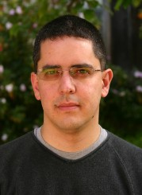

.. _personal:

================
 Fernando Pérez
================

A brief summary of where I come from... I was born in Medellín, Colombia [*]_,
where I did my undergraduate studies in Physics_ at the Universidad de
Antioquia.  From there I moved to Boulder, Colorado, where I completed my PhD
in :ref:`particle physics <instantons>`, before spending a few years as a
:ref:`post-doc <fast_algorithms>` in Applied Mathematics.  In 2008 I moved to
the San Francisco Bay Area, where I now work at UC Berkeley, on research
involving algorithms and tool development in neuroimaging.

I am a scientist and a geek, and thus I spend much of my time in front of
either the computer or a book.  If not there, you may find me climbing
(hopefully outdoors!) and probably with a camera.  Mostly of interest to
friends and family, I keep my pictures online at a `picasa album`__.

__ picasa_fperez_

I also have a blog_, where I mostly post items of interest related to IPython,
SciPy and scientific computing in Python.  I haven't been able to really get
caught up in the whole blogging thing, so it's rather sparse.  But people tell
me it's useful so I may try to post more, we'll see...

Photo note: The Mountains
=========================

The picture at the top is Colorado's incredible Continental Divide,
specifically the Indian Peaks range, shot from `Brainard Lake`_ during a
`beautiful fall day`_ in 2004.  On the descent from that hike I spotted a
great-looking `little couloir`_ that provided for a very nice `alpine day`_ one
week later.  Having that terrain 45 minutes from home is one thing (among many)
that makes the Colorado Front Range the most amazing place to live I've known.

.. _physics: fisica_udea_
.. _university: http://www.columbia.edu
.. _Brainard Lake: http://maps.google.com/maps/place?cid=1317471477502605538&q=brainard+lake,+colorado&hl=en
.. _beautiful fall day: http://picasaweb.google.com/fdo.perez/MountTollInTheFall
.. _little couloir: http://picasaweb.google.com/fdo.perez/MountTollInTheFall#4992668090352730130
.. _alpine day: http://picasaweb.google.com/fdo.perez/CouloirLittlePawneePeak

.. include:: contact.txt

**Footnotes**

.. [*] Yes, it's spelled like that, with two 'o's.  Columbia with a 'u' is a
   university_ in New York City.  It's not that hard: ColOmbia is a cOuntry,
   ColUmbia is a University.

.. include:: links.txt
