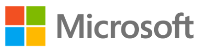

==========
 Sponsors
==========

The following institutions support IPython with significant resources:

In the summer of 2013, Microsoft made a `$100,000 donation
<microsoft-donation-2013.html>`_ to support all aspects of the IPython project.
	    

In December 2012, IPython was awarded a `$1.15 million grant
<sloan-grant.html>`_ from the `Alfred P. Sloan Foundation`_ that will fund the
core team for the 2013-2014 period.

.. image:: _static/RS_PoweredBy_OCC_logo-2c.png
    :target: http://www.rackspace.com
    :width: 400px

As of Summer 2013, `Rackspace <http://www.rackspace.com>`_ generously provides
cloud hosting for the project. This is used for development and the hosting of
IPython related services, such as the `IPython Notebook Viewer
<http://nbviewer.ipython.org>`_. We thank Jesse Noller and Kyle Kelley at
Rackspace for setting up this sponsorship and helping with deployment
respectively.

Contributing
============

If you would like to support the project by making a substantial or periodic
contribution, please contact us directly (ipython@gmail.com).  All donations to
IPython are handled by NumFOCUS_ and are tax-deductible in the USA.

Individuals can also `donate to IPython <donate.html>`_, and we are grateful
for every contribution!

Other support
=============

We gratefully acknowledge the support we've received over the years from the
following sources:

- Since 2011, we have had support from the US DoD High Performance Computing
  Modernization Program (HPCMP_), which funds several IPython developers in
  collaboration with the US Army Engineer Research and Development Center
  (ERDC_) that provides computing resources and support from the staff.

- `Enthought Inc`_ has supported IPython since its beginning in multiple forms,
  including --but not limited to-- the funding of our Qt console, hosting our
  website for many years, the continued hosting of our mailing lists, and the
  inclusion of IPython in the `Enthought Python Distribution`_.

- NiPy_/NIH: funding via the NiPy project (NIH grant 5R01MH081909-02) supported
  our 2009 refactoring work.
  
- Sage_/NSF: funding via the grant `Sage: Unifying Mathematical Software for
  Scientists, Engineers, and Mathematicians
  <http://modular.math.washington.edu/grants/compmath09>`_ (NSF grant
  DMS-1015114) supported our Seattle 2011 developer meeting.

- Microsoft's team working on `Python Tools for Visual Studio
  <http://pytools.codeplex.com>`_ developed the integraton of IPython into the
  Python plugin for Visual Studio 2010.

- `Tech-X Corporation <http://txcorp.com>`__ supported in 2008 the development
  of our parallel computing tools.

- Google Summer of Code: in 2005 and 2010 we've had GSoC support for prototypes
  in several areas of the project.

- The Ohio Supercomputer Center and the Department of Defense High Performance
  Computing Modernization Program (HPCMP), for sponsoring work in 2009 on our
  parallel computing tools.
  
- `Bivio Software <http://www.bivio.biz>`_ hosted an IPython sprint in 2006, in
  addition to their support of the Front Range Pythoneers group in Boulder, CO.
  
- GitHub_ hosts our development workflow and documentation.

- `ShiningPanda <https://www.shiningpanda.com/>`_ gives us a free `continuous
  integration service <https://jenkins.shiningpanda.com/ipython/>`_.

.. include:: links.txt
