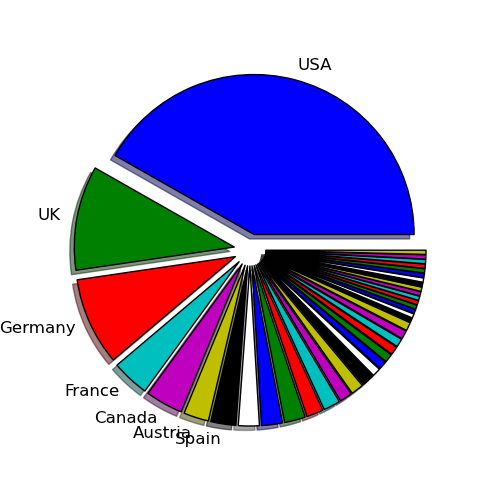
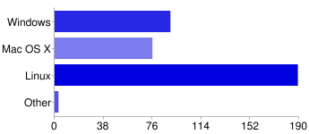
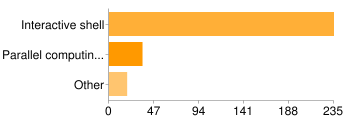
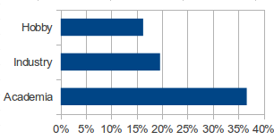

IPython User Survey 2011
========================

The first IPython user survey was run from 20 May 2011 to 21 September 2011, and
was promoted via the ipython-user mailing list and from the `IPython homepage
<index.html>`_. The questions (all optional) were:

* What country do you live in?
* On what platforms do you use IPython? (Windows, Mac OS X, Linux, Other)
* What parts of IPython do you use? (Interactive Shell, Parallel computing, Other)
* How do you use IPython?
* How would you like IPython to improve in the future?

In total, it attracted 240 responses, which can be viewed `here <https://docs.google.com/spreadsheet/ccc?key=0AqIElKUDQl8tdDMzREtNSk9pX282N3lxaXhiTmxyN0E&authkey=CNOmu-QC&hl=en_GB&authkey=CNOmu-QC>`_.
Thank-you to everyone who answered our questions.

Countries
---------

42% of respondents were in the USA, followed by the UK (11%) and Germany (9%).
In order of decreasing frequency, the full list of countries is:

USA, UK, Germany, France, Canada, Austria, Spain, Switzerland, Sweden, Australia,
Denmark, Norway, China, Singapore, Argentina, Greece, ** Romania, Russia, Finland,
Ireland, Italy, Brazil, Japan, Colombia, Peru, India, Uruguay, South Africa,
Taipei, New Zealand, Saudi Arabia, Holland, Ukraine, Belgium, Slovenia, Israel,
Luxembourg, Czech Republic

** Countries after this marker were only recorded by one respondent.

Platforms
---------

The majority of users use IPython on Linux (80%), with Windows (38%) and Macs
(32%) roughly equal. One user listed NetBSD, and one listed Solaris.

Usage
-----

Predictably, all respondents use the interactive shell. 15% also use parallel
computing features. Among 'Other', the only recurring answer was embedding
IPython. Note that the Qt console & HTML notebook were not included, as they
weren't released when the survey started.

Sector
------

Many respondents are in academia (37%), and they mentioned diverse branches of
the sciences. 20% of respondents are in some form of industry (five mentioned
finance), and 16% use it for personal or hobby development.

There was considerable overlap between groups, with many users in academia and
industry also using IPython at home. In addition, six respondents mentioned that
they were learning Python or programming, and three that they use it for teaching.

Note that these figures are collected from a free text answer, so they're somewhat
subjective.

Among the interesting areas in which IPython is used are:

* Programming hospital equipment
* Calibrating spaceflight instruments
* In the US Army Corps of Engineers
* Cinema ticketing systems
* Development of rolling stock (trains)
* Controlling a synchotron

Requests
--------

No theme seemed to appear in the answers to where future development should go.
I interpret this as a good sign—there's nothing our users feel is clearly
wrong.

Some users requested features that already exist, especially features in
the latest release (e.g. multiline editing, Python 3 support). Hopefully this
will improve as new releases get into distributions' repositories, but maybe we
should promote key features better.

10 respondents suggested that the documentation could be improved.

At least 8 users talked about better ways to reload modules. This seems to be a
fundamental difference between Python and MATLAB, but perhaps there are ways of
easing the experience for switchers.

8 respondents either use IPython in Emacs, or said that they'd like
better emacs bindings. Unfortunately, none of the core developers are motivated
to learn Emacs lisp, but we welcome contributions from Emacs users.

5 people mentioned better support for Windows. We're keen to support any platform,
and we have fixed many Windows bugs, but the main developers are Linux or Mac
users, so we rely on others to report issues. We have a productive collaboration
with Enthought, who bring IPython to many Windows users through EPD.

Design of the survey
--------------------

Next time, we could collect better data about:

* How many people use IPython in their own projects, e.g. embedding it or
  creating CLIs for libraries
* How people get IPython, e.g. via EPD, repositories or PyPI
* Whether people have used similar software before, e.g. MATLAB
* What sector respondents are in, in a more structured form

Every question, however, must be balanced against keeping the survey short so
that people finish answering it.
