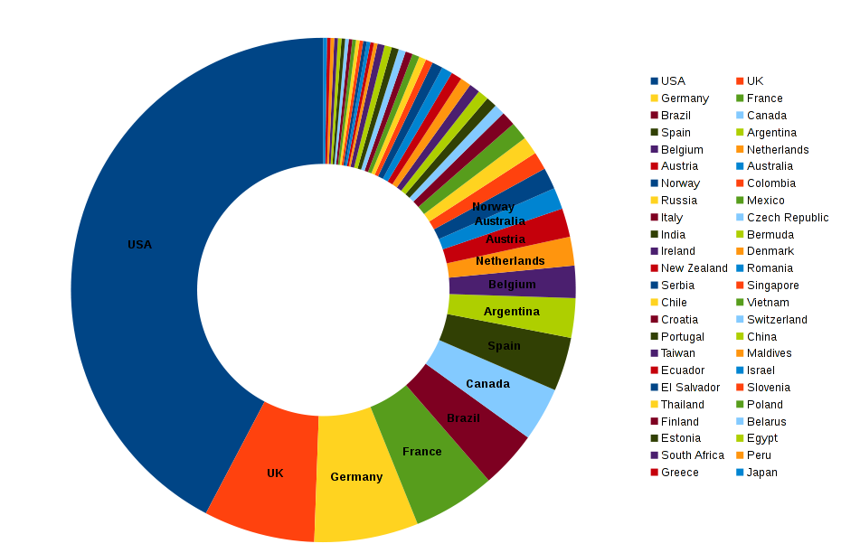
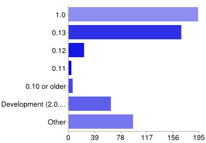
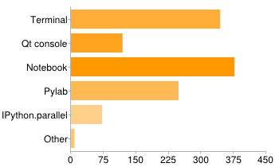
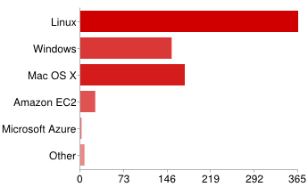
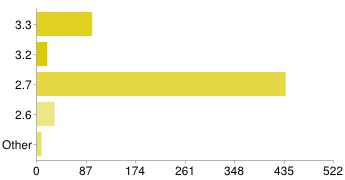
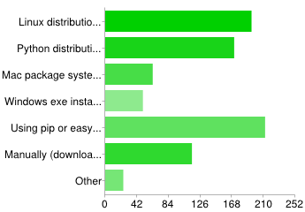
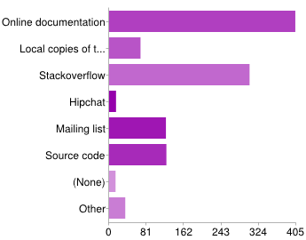
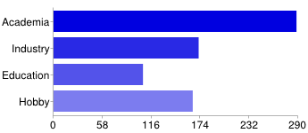

IPython User Survey 2013
========================

The full responses, and summaries of responses to some questions, are available
as `a Google Spreadsheet <https://docs.google.com/spreadsheet/pub?key=0AqIElKUDQl8tdHF2WmlKdTZTRlZVRGFGTDgtUXFBVUE&output=html>`_.

Countries
---------

42% of respondents were in the USA, followed by the UK (7.1%) and Germany (6.7%).
These numbers are largely similar to the last user survey, two years ago, but
the diversity of countries in the 'tail' has increased. In total, respondents
came from 48 countries (in descending order of frequency):

USA, UK, Germany, France, Brazil, Canada, Spain, Argentina, Belgium, Netherlands,
Austria, Australia, Norway, Colombia, Russia, Mexico, Italy, Czech Republic,
India, Bermuda, Ireland, Denmark, New Zealand, Romania, Serbia, Singapore, Chile,
Vietnam, Croatia, Switzerland, Portugal, China, Taiwan, Maldives, Ecuador,
Israel, El Salvador, Slovenia, Thailand, Poland, Finland, Belarus, Estonia,
Egypt, South Africa, Peru, Greece, Japan

See the 'Countries' sheet of the results spreadsheet for the cleaned data.

IPython versions
----------------

We see a rapid changeover - IPython 1.0 was released while the survey was
running, and by the end of the survey, more people reported using 1.0 than
0.13, the previous release. Very few people were using older releases, although
two people mentioned using the 0.8 series.

The survey respondents are probably biased towards people who actively update
IPython to newer versions, so we can assume that a greater proportion of the
total population of users are on older versions. Nonetheless, the take up rates
are encouraging.

IPython components
------------------

The notebook was the most popular component, with 84% saying they use it, followed
by the classic terminal interface (76%). The Qt console was the least used
interface (27%).

Over half of respondents use pylab (55%). 16% use the parallel computing framework
in IPython.

Other components that people mentioned include nbconvert, nbviewer, rmagic
and traitlets. We should include some of these in future surveys.

Platforms
---------

These results were similar to the previous survey. Linux was the most popular
operating system (81%), while roughly equal numbers use Windows (34%) and Mac
(39%). Of the cloud platforms, only Amazon EC2 has any significant usage, with
6% of respondents.

Minor platforms: two people listed Wakari here (others listed it under embedding
products). Two people use Microsoft Azure. FreeBSD, AIX, Rackspace and Raspberry
Pi were each mentioned once.

Python versions
---------------

As expected, Python 2.7 is the most widely used release (97%). However, a
significant fraction (22%) have also used IPython with Python 3.3. 7% of users
still use Python 2.6, and 4% use 3.2 - we will be dropping support for both of
these versions in IPython 2.0. Very few are on even older versions.

Projects integrating IPython
----------------------------

59 people (13%) reported using IPython with the `Spyder IDE <http://code.google.com/p/spyderlib/>`_.
Anecdotally, we have seen more people using Spyder in Europe than in North America,
and the results somewhat support this. Although the US was still the largest single
country among users of IPython and Spyder, it accounted for only 20% of
the users, less than the 42% from the US in the whole survey.

Projects integrating IPython with the two heavyweight editors, vim and emacs,
have 12 and 10 users respectively. A long list of other integrations included
editors, Python packages and hosted services on the web, but only a few
respondents mentioned each one.

See the 'Integration' sheet of the results spreadsheet for the cleaned data.

Installation
------------

No one installation method dominated. The leading techniques were pip/easy_install
(48%), Linux distribution repositories (44%) and Python distributions (38%).

Support resources
-----------------

Almost all users (91%) report using the online documentation, highlighting the
importance of keeping this up to date. Stackoverflow is also very important (68%).
In contrast, only 3% of respondents have used our Hipchat chat rooms - though
these are quite new, so people may not be aware of them yet.

Role
----

Once again, many of our users are in academia (65%), but we also have a
significant group of users in industry (38%) and 'hobby' usage (37%), i.e. people
using IPython outside their jobs. These numbers are not directly comparable to
the last survey, because last time, the categories were taken from a free text
answer.

24% of respondents also said they were using IPython in education. In the future,
we could break this down more to look at teaching and learning.

Use cases
---------

People's descriptions of the projects where they use IPython were many and varied.
A few specific highlights include modelling quantum computing systems (row 93 in the results spreadsheet),
computer vision (162), phylogenetic relationships of languages (201), e-Democracy
(261), pressure measurements under animals' feet (423), and processing data from
particle colliders (195) and gamma ray telescopes (454).

Grouping the responses, people are using IPython in at least these areas:

- Finance/economics
- Bioinformatics
- Neuroscience
- Chemistry
- Astronomy
- Physics

And in these ways:

- Machine learning
- Data cleaning
- Writing papers
- Developing other application and libraries
- Matlab replacement

Suggestions box
---------------

Categorised suggestions are listed on the 'Suggestions' sheet of the result
spreadsheet. Some responses were split into multiple suggestions.

A number of themes appeared:

- nbconvert: Already much improved since the survey, and we continue to improve it.
- File navigation, notebooks in different directories: Coming in IPython 2!
- Widgets: Coming in IPython 2!
- Interactive plots: Various projects are exploring this, and the new widget
  machinery in IPython 2 will provide a foundation for further work.
- Variable explorer: One can be built on top of the widget framework.
- Keyboard shortcuts: Much improved, and much more customisable, in IPython 2.
- JS API: IPython 2 has an 'nbextension' system, and the Javascript API is
  gradually becoming more stable.
- Better ways to deal with long notebooks: On the radar for IPython 3.
- Integration with other languages: IPython 3 will take a big step by integrating
  multiple kernel types into the UI.
- Multi-user support: A multi-user server is a goal for IPython 3. Other projects
  like Jiffylab and IPydra provide another model of multi-user server.
- Docs: We're improving them, but we could still do better.
- Parallel: ipcluster's launchers are in need of various improvements. We
  plan to rewrite the ipcluster script as an RPC service, which should improve
  many of these cases, especially SSH. The documentation could also use a lot of
  attention, especially because there were several requests for features that already exist.
- Security: After long discussion, we have created a new security model for
  IPython 2.
- Installation: We point new users to Anaconda, which is one download including
  Python, IPython, numpy, and many other packages. We know installation can be
  painful, but we don't know how to solve this well at the moment.
- Hiding cells: We plan to add options for this to nbconvert. We're also planning
  a way to tag cells in the notebook UI, which could be used to control what
  nbconvert shows.
- Concurrent editing: On the radar, but some way off. We need to get multi-user
  sorted out first.
- Python 3 support: I (Thomas) use Python 3 daily, and I'll keep improving docs,
  examples, etc.
- Editor features: We are enabling CodeMirror features like bracket matching.
  Features like refactoring tools and static analysis should be possible to write
  as extensions.
- Sphinx integration: On the radar. The yt project has done some work on this.
- Slideshows: Exporting to static slides with nbconvert has been improved since
  1.0, and there's ongoing development of an extension to present live,
  executable notebooks as slides.
- Integration with version control: No current plans.
- Debugger: No current plans.

Other comments
--------------

Categorised comments are listed on the 'Comments' sheet of the result
spreadsheet.

Thank-you to everyone who used the comments or suggestions fields to thank
or compliment us. We honestly weren't fishing for complements when we wrote the
survey.

A few more people wanted better documentation - see the section above.

Other than that, there was no theme apparent in the comments. All of them have
been read. If you want to follow up, please get in touch with us - the survey was
anonymous, so we can't get in touch with you.
